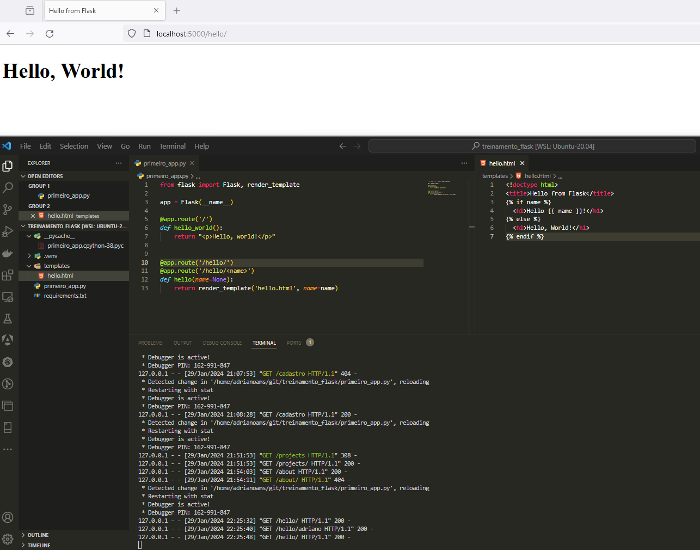

# Treinamento de Flask Framework

### Introdução ao Flask:
- [ ] Breve história e contexto.
- [ ] Principais qualidades do Flask

### Estrutura Básica do Flask:
  - [ ] Instalação e configuração.
  - [ ] Criando a aplicação Flask

### Rotas e Views:
  - [ ] Como definir rotas em Flask.
  - [ ] Funções de visualização (views).

### Templates:
  - [ ] Uso de templates para renderizar páginas web.
  - [ ] Integração de templates com Flask.
  
### Extensões em FLASK
  - [ ] Login na aplicação utilizando a extensão "flask-simple-login" 

### Modelos de Dados e ORM:
  - [ ] Trabalhando com modelos de dados.
  - [ ] Introdução a ORM (Object-Relational Mapping).

### Formulários:
  - [ ] Processamento de formulários em Flask.
  - [ ] Validação de dados de entrada.

### Middleware e Hooks:
  - [ ] Implementação de middleware.
  - [ ] Uso de ganchos (hooks) em Flask.

### Trabalhando com Banco de Dados:
  - [ ] Suporte a diferentes bancos de dados.
  - [ ] Uso de SQLAlchemy ou outro ORM.

### Extensões e Blueprints:
  - [ ] Como usar extensões em Flask.
  - [ ] Organização do código usando blueprints.

### Autenticação e Autorização:
  - [ ] Implementação de autenticação de usuários.
  - [ ] Controle de acesso e autorização.

### APIs em Flask:
  - [ ] Criação de APIs RESTful.
  - [ ] Uso de Flask-RESTful ou Flask-RestPlus.

### Testes em Flask:
  - [ ] Estratégias e ferramentas para testar aplicativos Flask.
  - [ ] Unidade, integração e testes funcionais.

### Desempenho e Otimização:
  - [ ] Estratégias para otimizar o desempenho do aplicativo.
  - [ ] Cache e outras técnicas de otimização.

### Implantação:
  - [ ] Opções de hospedagem e implantação.
  - [ ] Considerações de segurança.

### Comunidade e Recursos:
  - [ ] Referências a documentação.
  - [ ] Comunidade Flask e recursos adicionais.

### Estudos de Caso e Exemplos Práticos:
  - [ ] Demonstrar casos reais de aplicativos construídos com Flask.
  - [ ] Exemplos práticos de código.

---

### Introdução ao Flask:

#### Breve história e contexto.
O Flask é um framework web para Python que foi criado por <b>Armin Ronacher</b>. Lançado pela primeira vez em 2010, o Flask ganhou popularidade rapidamente devido à sua abordagem leve, modular e baseada em extensões. <b>Armin Ronacher</b>, conhecido por suas contribuições significativas à comunidade Python, desenvolveu o Flask com a intenção de fornecer um framework simples e fácil de usar para o desenvolvimento web em Python.


Armin Ronacher - Criador do Flask

A filosofia central do Flask é a <b>SIMPLICIDADE</b>. Ao contrário de outros frameworks web mais robustos, como Django, o Flask não impõe muitas convenções e permite que os desenvolvedores escolham as ferramentas e bibliotecas que melhor atendem às suas necessidades. Essa abordagem "micro" ou "minimalista" tornou o Flask uma escolha popular para projetos pequenos a médios, bem como para desenvolvedores que preferem liberdade e flexibilidade em suas implementações.

Inspirado pelo Django, outro framework web Python, o Flask abraça a ideia de que "menos é mais" e oferece apenas o essencial para a construção de aplicativos web. A comunidade Flask cresceu rapidamente, impulsionada pela facilidade de aprendizado e pela documentação clara fornecida pelo projeto.

Ao longo dos anos, o Flask evoluiu continuamente com melhorias e atualizações, mantendo sua reputação como uma escolha acessível e poderosa para o desenvolvimento web em Python. Seu sucesso é evidenciado pelo número crescente de aplicativos e empresas que escolhem o Flask como sua base para construir aplicações web eficientes e escaláveis.

#### Principais qualidades do Flask

* <b>Minimalismo:</b> 
    A aplicação pode começar pequena e ir crescendo aos poucos, você pode por exemplo desenvolver uma prova de conceito para demonstração de uma idéia de uma solução e conforme isso se amadureça, poderá continuar a evoluir a idéia.

* <b>Extensibilidade</b>
  Diz respeito a possibilidade de utilização de bibliotecas acessórias para funcionalidades específicas da aplicação, como exemplo autenticação, acesso a banco de dados ficando assim de uma forma agnóstica, podendo ser facilmente substituída em caso de necessidade.

* <b>Liberdade</b>
  O Flask por ser minimalista te dá plena liberdade de arquitetar a aplicação com os 
  componentes que desejar não te deixando dependente de bibliotecas ineficientes em um determinado ponto que o projeto ganha um certo volume de complexidade.

* <b>Performance</b>
  
 * <b>Robustez</b>
  Dificilmente o Flask quebra por ter por traz de seu core principal de código o Werkzoig(Servidor Web bem robusto e estável) e o Jinja2(template engine padrão para app python)

* <b>Padrão</b>
  Por aplicar vários padrões de projeto em sua implementação, quando você aprende a codar com Flask de quebra adquire-se conhecimento técnico para o aprendizado de outros frameworks do mercado, por exemplo, o Django e o FastAPI que são frameworks FullStack e implementam basicamente os mesmos padrões, porém atendem interesses diferentes do Flask que é um framework minimalista. 

### Estrutura Básica do Flask:
  #### Instalação e configuração.
  Recomenda-se utilizar a última versão do python, neste treinamento utilizaremos a versão mais recente 3.8

  No decorrer do treinamento será necessária a instalação de diferentes libs python para a execução do projeto de exemplo, fazendo-se necessária a instalação das mesmas em um ambiente isolado para que não haja interferência na versão do python instalada no host do usuário e também para termos a flexibilidade de não termos erros causados por diferentes ambientes aos quais a aplicação executará. Com isso temos uma solução para este isolamento que chamamos de "Virtual Environment"(venv) que possibilitam este isolamento de nossa aplicação em grupos independentes de bibliotecas python.

  Criando a pasta `.env` para criação da Virtual Environment 
  ``` 
    $ mkdir treinamento_flask
    $ cd myproject
    $ python3 -m venv .venv
  ```
  A seguinte estrutura será criada:
  
  

  Ativando a Virtual Environment
  ```
    $ . .venv/bin/activate
  ```
  
  
  Para instalar o Flask execute
  ```
  $ pip install Flask
  ```
  

  Na estrutura de pastas note que as libs utlizadas internanmente pelo Flask são instaladas
  

  Execute o seguinte comando para visualizar as libs instaladas no terminal:
  ```
  pip freeze
  ```
  Exibindo-se no terminal conforme abaixo:
  


  Para que seja possivel a instalação das diferentes libs em nosso projeto optaremos por utilizar um arquivo chamado de "requirements.txt" que concentrará todos os nomes e versões de nossas libs python necessárias ao projeto, para isso execute o seguinte comando:
  ```
  touch requirements.txt
  ```
  E insira neste arquivo o seguinte:
  ```
  flask==3.0.1
  ```
   
  Com isso será possível realizar a instalação das libs necessárias ao projeto em um outro ambiente apenas executando o seguinte comando:
  ``` pip install -r requirements.txt ```

#### Criando a aplicação Flask
Para criação de uma aplicação Flask crie um arquivo chamado `primeiro.py` como contéudo deste arquivo digite o seguinte código abaixo:
```
from flask import Flask

app = Flask(__name__)

@app.route("/")
def hello_world():
    return "<p>Hello, World!</p>"
```
1. Importando a definição da classe "Flask" da lib "flask"
   `from flask import Flask`
2. Instanciando um novo app Flask e armazenando na variável "app":
   `app = Flask(__name__) ` 
3. Utilizando o decorator "app.route() a fim de definir uma rota que invocará nossas funções
   ```@app.route("/")```
4. A função "hello_world" que mostrará a mensagem "Hello, World" na tela
   ```   
   def hello_world():
     return "<p>Hello, World!</p>"
   ```

Para servir a aplicação Flask digite o seguinte código no terminal:
`$ flask --app primeiro_app run`

Após a execução deste comando a aplicação ficará disponível na porta 5000, conforme mostrado abaixo:


Pronto! Agora que já temos nossa aplicação no ar podemos configurar novas rotas no arquivo `app.py`:
```
@app.route('/cadastro')
def index():
    return 'Index Page'
```

Acessando no navegador web:


Por que este erro aconteceu?

O Flask por padrão executa a aplicação em modo "development" sem a opção `--debug` por padrão e, neste estado, as alterações nos arquivos não são aplicadas de imediato no servidor, somente após reiniciar a aplicação. Caso o modo debug esteja habilitado a alteração que fizemos inserindo as rotas "/cadastro" e "/hello" serão aplicadas imediatamente.

Para habilitar o modo debug, use a opção `--debug`
`$ flask --app primeiro_app run --debug`


Acessando as novas urls após alteração no código:


### Rotas e Views:

#### Como definir rotas em Flask.
Aplicações modernas utilizam este mecanismo de URLs para ajudar os usuários a acessar os recursos da aplicação. É uma forma amigável do usuário acessar um recurso por um nome semântico simples que faça sentido e que ele possa facilmente lembrar

Para relacionar uma definição de url à chamada de uma função que executará algo na aplicação podemos utlizar o decorator `route()`:
```
@app.route('/')
def index():
    return 'Index Page'

@app.route('/hello')
def hello():
    return 'Hello, World'
```

Podemos também passar parâmetros para estas urls que podem ou não ter um tipo específico de dado, seguindo a seguinte sintaxe `<converter:variable_name>`.
Exs:
```
@app.route('/user/<username>')
def show_user_profile(username):
    # Mostra o perfil para um usuário
    return f'User {escape(username)}'

@app.route('/post/<int:post_id>')
def show_post(post_id):
    # Mostrando um post para um determinado id passado como parâmetro, o id é um integer
    return f'Post {post_id}'

@app.route('/path/<path:subpath>')
def show_subpath(subpath):
    # Mostra o subpath após /path/
    return f'Subpath {escape(subpath)}'
```

Tipo Conversores

| Tipo |                   Descrição                  |
| -------| -------------------------------------------|
| string | (default) accepts any text without a slash |
| int    | accepts positive integers                  |
| floa   | accepts positive floating point values     |
| path   | like string but also accepts slashes       |
| uuid   | accepts UUID strings                       |

#### URLs únicas / Comportamento de Redirecionamento
As duas regras de definição de urls mostradas abaixo diferem-se com relação ao uso do caracter `/` ao final da URL:
```
@app.route('/projects/')
def projects():
    return 'The project page'

@app.route('/about')
def about():
    return 'The about page'
```

Na URL `/project/` existe uma barra no final, isto significa que caso haja o acesso a mesma sem informar a barra ao final a aplicação se comportará normalmente acessando o recurso solicitado.


Ao contrário, na URL `/about`, não é informada a barra, isto significa se o usuário somente poderá acessar este recurso se não informar a barra, caso a barra seja informada ao final será disparado um erro de acesso à url, conforme demonstrado abaixo:


#### Funções de visualização (views).
Como mostrado nos exemplos anteriores as "Views" são as funções que são acionadas por uma determinada rota e realizam um processamento retornando um resultado, normalmente uma mensagem ou até mesmo um arquivo de template, por exemplo, um arquivo ".html".

### Templates:

#### Uso de templates para renderizar páginas web.
Em flask as funções nas views podem retornar texto puro ou até mesmo templates que efetuam algum processamento de informações e no final convertem tudo para texto, primariamente gerando páginas HTML, mas podem gerar outros tipos de arquivo tais como markdown, plain text para emails entre outros.

Para renderizar um template usaremos o método `render_template` fornecido pelo Flask. Tudo que você precisa informar à este método é o nome do template e variáveis que serão utilizadas no processamento do template. Abaixo segue um exemplo de renderização de um template:
```
from flask import render_template

@app.route('/hello/')
@app.route('/hello/<name>')
def hello(name=None):
    return render_template('hello.html', name=name)
```
Crie uma pasta na raiz do projeto chamada `templates` e um arquivo chamado `hello.html`:
```
mkdir templates
cd templates
touch hello.html
```
 Insira o segunte conteúdo no arquivo `hello.html`
 ```
 <!doctype html>
<title>Hello from Flask</title>

  <h1>Hello {{ name }}!</h1>

  <h1>Hello, World!</h1>

 ```
Ao acessar a URL `/hello/` o template é processado da seguinte forma:



Ao acessar a URL `/hello/Adriano` no processamento do template é utilizado o argumento `name` passado como parâmetro, exibindo na tela `Hello, Adriano`


### Redirecionamentos e Erros
Para redirecionar um usuário para outro endpoint use a função `redirect()` e para abortar um request devolvendo neste request um código de erro use a função `abort()`:
```
from flask import abort, redirect, url_for

@app.route('/')
def index():
    return redirect(url_for('login'))

@app.route('/login')
def login():
    abort(401)
    this_is_never_executed()
```

Caso queira personalizar uma pagina de erro para o retorno de um request utilize o decorator `errorhandler()` acima da função:
```
from flask import render_template

@app.errorhandler(404)
def page_not_found(error):
    return render_template('page_not_found.html'), 404
```


### Modelos de Dados e ORM:

#### Trabalhando com modelos de dados.

#### Introdução a ORM (Object-Relational Mapping).


### Formulários:

#### Processamento de formulários em Flask.

#### Validação de dados de entrada.


### Middleware e Hooks:

#### Implementação de middleware.

#### Uso de ganchos (hooks) em Flask.


### Trabalhando com Banco de Dados:

#### Suporte a diferentes bancos de dados.

#### Uso de SQLAlchemy ou outro ORM.


### Extensões e Blueprints:

#### Como usar extensões em Flask.

#### Organização do código usando blueprints.


### Autenticação e Autorização:

#### Implementação de autenticação de usuários.

#### Controle de acesso e autorização.


### APIs em Flask:

#### Criação de APIs RESTful.

#### Uso de Flask-RESTful ou Flask-RestPlus.


### Testes em Flask:

#### Estratégias e ferramentas para testar aplicativos Flask.

#### Unidade, integração e testes funcionais.


### Desempenho e Otimização:

#### Estratégias para otimizar o desempenho do aplicativo.

#### Cache e outras técnicas de otimização.


### Implantação:

#### Opções de hospedagem e implantação.

#### Considerações de segurança.


### Comunidade e Recursos:

#### Referências a documentação.

#### Comunidade Flask e recursos adicionais.


### Estudos de Caso e Exemplos Práticos:

#### Demonstrar casos reais de aplicativos construídos com Flask.

#### Exemplos práticos de código.

