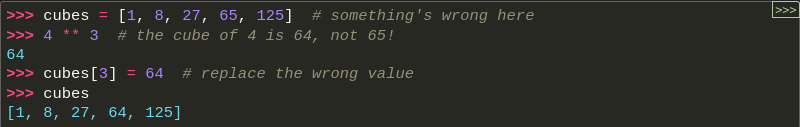
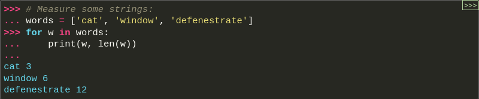
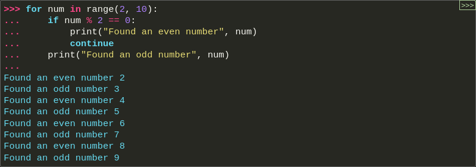

# Python
## Uma visão geral da linguagem

### Principais características
- Linguagem de fãcil aprendizado por apresentar uma sintaxe simplificada
- Estrutura de dados de alto nível orientada da objetos.
- Linguagem elegante de sintaxe e tipagem dinâmica aliadas com sua natureza interpretativa
- Interpretador python e uma extensiva biblioteca padrão disponíveis gratuitamente em código ou de forma binária.
- Possui tipos de alto nível, tais como dicionários e vetores(arrays)
- Python permite a oganização dos programas em módulos que podem ser reutilizados em outro programas escritos em python que implementam:
    - Manipulação de arquivos
    - Chamadas do sistema
    - Sockets
    - Construção de Interfaces gráficas
- Python é extensível provendo:
    - Facilidade para adicionar funções ou módulos no interpretador;
    - Desempenhar operações críticas em máxima velocidade;

### Utilizando o interpretador

Para acessar o modo interativo do python no terminal digite o seguinte comando:

` python3.12`

Após o comando acima o modo interativo será chamado, como mostrado abaixo:


É possivel a digitação de comandos multilinha:


#### Numeros
Podemos também trabalhar como operações aritméticas, parenteses pode ser utilizados para agrupar expressões, por exemplo:


Inteiros são do tipo <b>int<b>
Números fracionários são do tipo <b>float<b> 


Com Python, é possível usar o operador ** para calcular potências:


Além de int e float, o Python suporta outros tipos de números, tais como Decimal e Fraction. O Python também possui suporte nativo a números complexos, e usa os sufixos j ou J para indicar a parte imaginária (por exemplo, 3+5j).

#### Textos

Python pode manipular texto (representado pelo tipo str, também chamado de “strings”), bem como números. Isso inclui caracteres “!”, palavras “coelho”, nomes “Paris”, frases “Eu te protejo.”, etc. “Oba! :)”. Eles podem ser colocados entre aspas simples ('...') ou aspas duplas ("...") com o mesmo resultado


Escapando aspas precedendo-as com \ .Alternativamente, podemos usar outro tipo de aspas:


No shell do Python, a definição de string e a string de saída podem parecer diferentes. A função print() produz uma saída mais legível, omitindo as aspas delimitadoras e imprimindo caracteres de escape e especiais:


Se não quiseres que os caracteres sejam precedidos por \ para serem interpretados como caracteres especiais, poderás usar strings raw (N.d.T: “crua” ou sem processamento de caracteres de escape) adicionando um r antes da primeira aspa:


Utilizando aspas trilplas:


Strings podem ser concatenadas (coladas) com o operador +, e repetidas com *:


Esse recurso é particularmente útil quando você quer quebrar strings longas:


#### Listas

Python inclui diversas estruturas de dados compostas, usadas para agrupar outros valores. A mais versátil é list (lista), que pode ser escrita como uma lista de valores (itens) separados por vírgula, entre colchetes. Os valores contidos na lista não precisam ser todos do mesmo tipo.


Listas podem ser indexadas ou fatiadas:


Listas suportam operações de concatenação:


Diferentemente de strings, que são imutáveis, listas são mutáveis, ou seja, é possível alterar elementos individuais de uma lista:



Adicionando ítens utilizando o método .append:


Tamanho da lista com o método len():


## Ferramentas de Controle de fluxo

### Comando if

O código abaixo exemplifica a utilização do comando if:


### Comando for

O comando for em Python é um pouco diferente do que costuma ser em C ou Pascal. O comando for do Python itera sobre os itens de qualquer sequência (seja uma lista ou uma string), na ordem que aparecem na sequência. Por exemplo:



### A função range()

Se você precisa iterar sobre sequências numéricas, a função embutida range() é a resposta. Ela gera progressões aritméticas:


O ponto de parada fornecido nunca é incluído na lista; range(10) gera uma lista com 10 valores, exatamente os índices válidos para uma sequência de comprimento 10. É possível iniciar o intervalo com outro número, ou alterar a razão da progressão (inclusive com passo negativo):


Para iterar sobre os índices de uma sequência, combine range() e len() da seguinte forma:


### Comandos break e continue, e cláusula else, nos laços de repetição

A instrução break sai imediatamente do laço de repetição mais interno, seja for ou while.

Um laço for ou while pode incluir uma cláusula else.

Em um laço for, a cláusula else é executada após o laço atingir sua iteração final.

Em um laço while, ele é executado após a condição do laço se tornar falsa.

Em qualquer tipo de laço, a cláusula else não é executada se o laço for encerrado por um break.

Isso é exemplificado no seguinte laço for, que procura por números primos:


(Sim, o código está correto. Olhe atentamente: a cláusula else pertence ao laço for, e não ao comando if.)

Quando usado em um laço, a cláusula else tem mais em comum com a cláusula else de um comando try do que com a de um comando if: a cláusula else de um comando try executa quando não ocorre exceção, e o else de um laço executa quando não ocorre um break. Para mais informações sobre comando try e exceções, veja Tratamento de exceções.

A instrução continue, também emprestada da linguagem C, continua com a próxima iteração do laço:




### Comandos pass
O comando pass não faz nada. Pode ser usada quando a sintaxe exige um comando mas a semântica do programa não requer nenhuma ação. Por exemplo:


Isto é usado muitas vezes para se definir classes mínimas:


### Definindo funções

Podemos definir uma função utilizando a palavra reservada "def" seguida do nome da função acompanhada de um sinal de parêntese, onde são informados os parâmetros:

```
def calcular_aumento_salarial(tipo_funcionario, salario):
    if tipo_funcionario == 'gerente':
        return salario * 0.1
    elif tipo_funcionario == 'encarregado':
        return salario * 0.08
    else:
        return salario * 0.05

gerente = Funcionario(tipo='gerente', salario=2000)

novo_salario = calcular_aumento_salarial(gerente,tipo, gerente.salario)

print(novo_salario)
2200
```
### Argumentos nomeados

Funções também podem ser chamadas usando argumentos nomeados da forma chave=valor. Por exemplo, a função a seguir:


aceita um argumento obrigatório (voltage) e três argumentos opcionais (state, action, e type). Esta função pode ser chamada de qualquer uma dessas formas:


### Desempacotando listas de argumentos

Se os valores já estiverem juntos em uma lista ou tupla, escreva a chamada de função com o operador * para desempacotá-los da sequência:


Da mesma forma, dicionários podem produzir argumentos nomeados com o operador **:


### Expressões lambda

Pequenas funções anônimas podem ser criadas com a palavra-chave lambda. Esta função retorna a soma de seus dois argumentos: lambda a, b: a+b. As funções lambda podem ser usadas sempre que objetos função forem necessários. Eles são sintaticamente restritos a uma única expressão. Semanticamente, eles são apenas açúcar sintático para uma definição de função normal. Como definições de funções aninhadas, as funções lambda podem referenciar variáveis contidas no escopo:


### Strings de documentação

Eis um exemplo de uma string de documentação multilinha:


## Estruturas de dados

### <b>Mais sobre listas</b>

O tipo de dado lista tem ainda mais métodos. Aqui estão apresentados todos os métodos de objetos do tipo lista:

list.append(x)

    Adiciona um item ao fim da lista. Equivalente a a[len(a):] = [x].

list.extend(iterable)

    Prolonga a lista, adicionando no fim todos os elementos do argumento iterable passado como parâmetro. Equivalente a a[len(a):] = iterable.

list.insert(i, x)

    Insere um item em uma dada posição. O primeiro argumento é o índice do elemento antes do qual será feita a inserção, assim a.insert(0, x) insere um elemento na frente da lista e a.insert(len(a), x) e equivale a a.append(x).

list.remove(x)

    Remove o primeiro item encontrado na lista cujo valor é igual a x. Se não existir valor igual, uma exceção ValueError é levantada.

list.pop([i])

    Remove o item na posição fornecida na lista e retorna. Se nenhum índice for especificado, a.pop() remove e retorna o último item da lista. Levanta um IndexError se a lista estiver vazia ou o índice estiver fora do intervalo da lista.

list.clear()

    Remove todos os itens de uma lista. Equivalente a del a[:].

list.index(x[, start[, end]])

    Devolve o índice base-zero do primeiro item cujo valor é igual a x, levantando ValueError se este valor não existe.

    Os argumentos opcionais start e end são interpretados como nas notações de fatiamento e são usados para limitar a busca para uma subsequência específica da lista. O índice retornado é calculado relativo ao começo da sequência inteira e não referente ao argumento start.

list.count(x)

    Devolve o número de vezes em que x aparece na lista.

list.sort(*, key=None, reverse=False)

    Ordena os itens na lista (os argumentos podem ser usados para personalizar a ordenação, veja a função sorted() para maiores explicações).

list.reverse()

    Inverte a ordem dos elementos na lista.

list.copy()

    Devolve uma cópia rasa da lista. Equivalente a a[:].

Um exemplo que usa a maior parte dos métodos das listas:


### Tuplas e Sequências

Vimos que listas e strings têm muitas propriedades em comum, como indexação e operações de fatiamento. Elas são dois exemplos de sequências (veja Tipos sequências — list, tuple, range). Como Python é uma linguagem em evolução, outros tipos de sequências podem ser adicionados. Existe ainda um outro tipo de sequência padrão na linguagem: a tupla.

Uma tupla consiste em uma sequência de valores separados por vírgulas, por exemplo:


Como você pode ver no trecho acima, na saída do console as tuplas são sempre envolvidas por parênteses, assim tuplas aninhadas podem ser lidas corretamente. Na criação, tuplas podem ser envolvidas ou não por parênteses, desde que o contexto não exija os parênteses (como no caso da tupla dentro de uma expressão maior). Não é possível atribuir itens individuais de uma tupla, contudo é possível criar tuplas que contenham objetos mutáveis, como listas.

Apesar de tuplas serem similares a listas, elas são frequentemente utilizadas em situações diferentes e com propósitos distintos. Tuplas são imutáveis, e usualmente contém uma sequência heterogênea de elementos que são acessados via desempacotamento (ver a seguir nessa seção) ou índice (ou mesmo por um atributo no caso de namedtuples). Listas são mutáveis, e seus elementos geralmente são homogêneos e são acessados iterando sobre a lista.

Um problema especial é a criação de tuplas contendo 0 ou 1 itens: a sintaxe usa certos truques para acomodar estes casos. Tuplas vazias são construídas por um par de parênteses vazios; uma tupla unitária é construída por um único valor e uma vírgula entre parênteses (não basta colocar um único valor entre parênteses). Feio, mas funciona. Por exemplo:


### Conjuntos

Python também inclui um tipo de dados para conjuntos, chamado set. Um conjunto é uma coleção desordenada de elementos, sem elementos repetidos. Usos comuns para conjuntos incluem a verificação eficiente da existência de objetos e a eliminação de itens duplicados. Conjuntos também suportam operações matemáticas como união, interseção, diferença e diferença simétrica.

Chaves ou a função set() podem ser usados para criar conjuntos. Note: para criar um conjunto vazio você precisa usar set(), não {}; este último cria um dicionário vazio, uma estrutura de dados que discutiremos na próxima seção.

Uma pequena demonstração:


Da mesma forma que compreensão de listas, compreensões de conjunto também são suportadas:


### Dicionários

Outra estrutura de dados muito útil embutida em Python é o dicionário, cujo tipo é dict (ver Tipo mapeamento — dict). Dicionários são também chamados de “memória associativa” ou “vetor associativo” em outras linguagens. Diferente de sequências que são indexadas por inteiros, dicionários são indexados por chaves (keys), que podem ser de qualquer tipo imutável (como strings e inteiros). Tuplas também podem ser chaves se contiverem apenas strings, inteiros ou outras tuplas. Se a tupla contiver, direta ou indiretamente, qualquer valor mutável, não poderá ser chave. Listas não podem ser usadas como chaves porque podem ser modificadas internamente pela atribuição em índices ou fatias, e por métodos como append() e extend().

Um bom modelo mental é imaginar um dicionário como um conjunto não-ordenado de pares chave:valor, onde as chaves são únicas em uma dada instância do dicionário. Dicionários são delimitados por chaves: {}, e contém uma lista de pares chave:valor separada por vírgulas. Dessa forma também será exibido o conteúdo de um dicionário no console do Python. O dicionário vazio é {}.

As principais operações em um dicionário são armazenar e recuperar valores a partir de chaves. Também é possível remover um par chave:valor com o comando del. Se você armazenar um valor utilizando uma chave já presente, o antigo valor será substituído pelo novo. Se tentar recuperar um valor usando uma chave inexistente, será gerado um erro.

Executar list(d) em um dicionário devolve a lista de todas as chaves presentes no dicionário, na ordem de inserção (se desejar ordená-las basta usar a função sorted(d)). Para verificar a existência de uma chave, use o operador in.

A seguir, um exemplo de uso do dicionário:


O construtor dict() produz dicionários diretamente de sequências de pares chave-valor:


Além disso, as compreensões de dicionários podem ser usadas para criar dicionários a partir de expressões arbitrárias de chave e valor:


Quando chaves são strings simples, é mais fácil especificar os pares usando argumentos nomeados no construtor:


